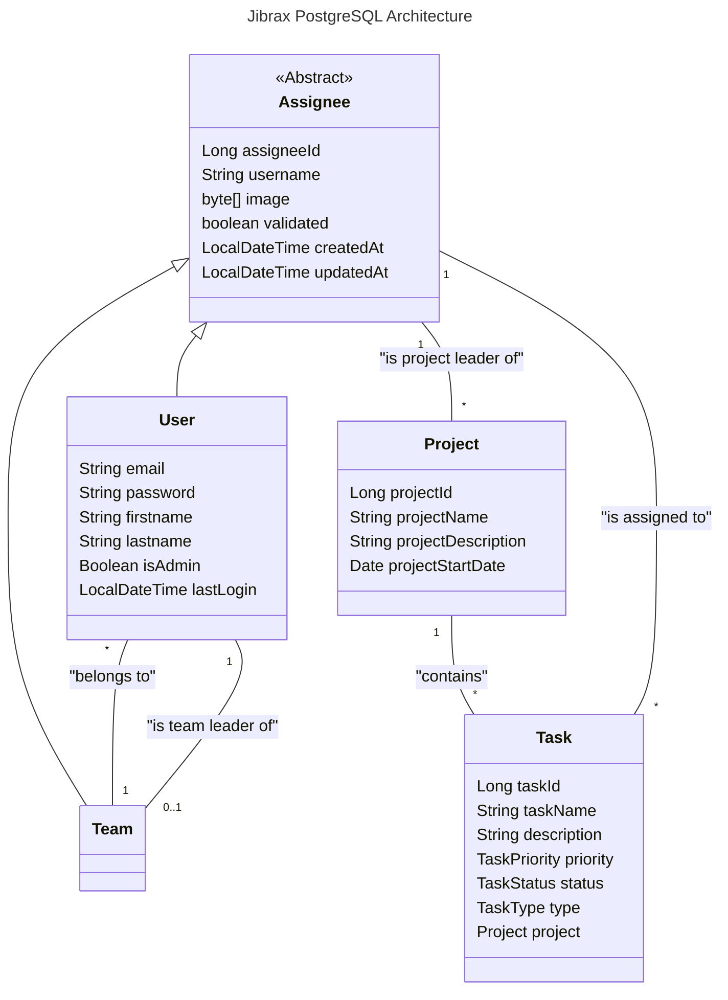

.

[TOC]

# Jibrax 

## Status

 

## Context

Jibrax is a project developed as part of the Advanced Software Architecture course in the Master’s program in Software Engineering at ISTIC, University of Rennes.
The primary objective of this project is to apply the concepts covered during the lectures, including:
- Designing and implementing the Java Persistence API (JPA),
- Exploring advanced software architecture techniques,
- Handling persistence, data modeling, and transactions,
- Integrating with a relational database (PostgreSQL) through JPA mappings.

Beyond practicing these technical aspects, we decided to implement a team-oriented project management system. The system is structured around four main entities:
- Users → individuals registered in the platform,
- Teams → groups of users collaborating together,
- Projects → initiatives managed by teams,
- Tasks → work items that make up each project.

This allows us to simulate a real-world collaborative environment while applying advanced software design and persistence principles.

## Git structure 

In this git project you may find multiple branch each corresponding to a part of the Advanced Software Architecture course.
- main
- →main-spring←
- main-servelet
- main-jaxrs-openapi

## User stories

### Write

- Create/Delete/Update a new team.
- Create/Delete/Update a new user.
- Create/Delete/Update a project.
- Create/Delete/Update a task.

### Query

- Get users' information.
- Get user by id.
- Get user by username.
- Get user by email.
- Get users' by team id.
- Get teams' information.
- Get team by id.
- Get team by name.
- Get projects' information.
- Get project by id.
- Get project by leader.
- Get task by id.
- Get tasks by project id.
- Get tasks by assignee id.

## Database Architecture

The backend relies on a PostgreSQL database running inside a Docker container. 
- Default exposed port: 5432 (can be remapped if needed). 
- Database schema and tables are generated automatically based on JPA entity definitions.

You can interact with the database using:
- The psql CLI, 
- A GUI client such as pgAdmin or DBeaver, 
- Or directly from the container with: ``docker exec -it <container_name> psql -U postgres -d <database_name>`` 

The following class diagram explains how entities are organised and linked:


The previous class diagram shows the following architecture choices:
- The abstract class _Assignee_ **is implemented by** concrete classes _User_ and _Team_
- A team **can** contain **multiple** (*) users.
- A user must be part of **one** (1) team.
- A user **can** be the team leader of **one team** (0..1).
- A project **can** contain **multiple** (*) tasks.
- A task is part of **one** (1) project.
- A project has **one** project leader which is an _Assignee_.
- An assignee **can** be the leader of **multiple** (*) project.
- A task has **one** (1) assignee entity.
- An assignee **can** be assigned to **multiple** (*) tasks.

## How to Run

### Requirements
- Java 21+ 
- Maven 
- Docker & Docker Compose

### Local setup
1. Clone or download the project: 
```
git clone https://gitlab2.istic.univ-rennes1.fr/tduluard/jibrax.git
cd jibrax
```
2. Start the service with Docker Compose (PostgreSQL + pgAdmin + Keycloak):
```
./jibrax-setup.sh
```
or
```
./startPostgres.bat
```
If you are using bat version, the creation of the three default users will not be applied. 
3. Then run the Application (JibraxApplication)
4. (Optionnal) Verify that the data has been correctly inserted into PostgreSQL by querying the database with psql or a GUI client.

### External setup

1. A PostgreSQL database is hosted on a personal TrueNAS server. **IMPORTANT**: Use it with extreme care, any misuse could result in data corruption or loss affecting other users.
2. Only the following public user is provided:
```
url: jdbc:postgresql://jibrax.tduluard.fr:5432/jibrax
username: dbuser
password: pwddbuser
```
This account has permissions limited to creating and reading tables, as well as ingesting and querying data.

3.Remember to update the ``persistenceUnitName`` in your main file to: ``postgresql-nas``.


## API Permissions

This table lists all access permissions for the various API endpoints.

### Legend

- ✅ : Access granted
- ❌ : Access denied
- 🔓 : Publicly accessible (no authentification required)

### Table des permissions

| Endpoint                    | Method | 🔓 Public | 👤 USER | 👔 MANAGER | 👑 ADMIN | Description              |
|-----------------------------|--------|-----------|---------|------------|----------|--------------------------|
| **Documentation & Health**  |        |           |         |            |          |                          |
| `/swagger-ui/**`            | ALL    | 🔓        | ✅       | ✅          | ✅        | Swagger UI interface     |
| `/v3/api-docs/**`           | ALL    | 🔓        | ✅       | ✅          | ✅        | OpenAPI documentation    |
| `/actuator/health`          | GET    | 🔓        | ✅       | ✅          | ✅        | Application Health check |
| **Authentication**          |        |           |         |            |          |                          |
| `/api/auth/login`           | POST   | 🔓        | ✅       | ✅          | ✅        | User login               |
| `/api/auth/pending`         | GET    | ❌         | ❌       | ❌          | ✅        | List of pending accounts |
| `/api/auth/{id}/validate`   | POST   | ❌         | ❌       | ❌          | ✅        | Account validation       |
| **Users**                   |        |           |         |            |          |                          |
| `/api/users`                | POST   | 🔓        | ✅       | ✅          | ✅        | User Registration        |
| `/api/users/me`             | GET    | ❌         | ✅       | ✅          | ✅        | Current user profile     |
| `/api/users/**`             | GET    | ❌         | ✅       | ✅          | ✅        | Retrieve users           |
| `/api/users/**`             | PUT    | ❌         | ❌       | ✅          | ✅        | Update user              |
| `/api/users/**`             | DELETE | ❌         | ❌       | ❌          | ✅        | Delete user              |
| **Teams**                   |        |           |         |            |          |                          |
| `/api/teams/**`             | GET    | ❌         | ✅       | ✅          | ✅        | Retrieve teams           |
| `/api/teams`                | POST   | ❌         | ❌       | ✅          | ✅        | Create team              |
| `/api/teams/**`             | PUT    | ❌         | ❌       | ✅          | ✅        | Update team              |
| `/api/teams/**`             | DELETE | ❌         | ❌       | ❌          | ✅        | Delete team              |
| **Projects**                |        |           |         |            |          |                          |
| `/api/projects/**`          | GET    | ❌         | ✅       | ✅          | ✅        | Retrieve projects        |
| `/api/projects`             | POST   | ❌         | ❌       | ✅          | ✅        | Create project           |
| `/api/projects/**`          | PUT    | ❌         | ❌       | ✅          | ✅        | Update project           |
| `/api/projects/**`          | DELETE | ❌         | ❌       | ❌          | ✅        | Delete project           |
| **Tasks**                   |        |           |         |            |          |                          |
| `/api/tasks/**`             | GET    | ❌         | ✅       | ✅          | ✅        | Retrieve tasks           |
| `/api/tasks`                | POST   | ❌         | ✅       | ✅          | ✅        | Create task              |
| `/api/tasks/**`             | PUT    | ❌         | ✅       | ✅          | ✅        | Update task              |
| `/api/tasks/**`             | DELETE | ❌         | ❌       | ✅          | ✅        | Delete task              |

### Role Hierarchy

```
👑 ADMIN
  └── Full access (read, write, delete on all resources)
  
👔 MANAGER
  └── Manage teams, projects, and tasks (read & write)
  └── View and edit users
  
👤 USER
  └── View teams, projects, and tasks
  └── Create and edit tasks
  └── View own profile
```

### Important Notes

- **Authentification** : Managed via JWT (OAuth2 Resource Server with Keycloak)
- **Sessions** : Stateless (No server-side session)
- **Error codes** :
    - `401 Unauthorized` : Missing or invalid token
    - `403 Forbidden` : Valid token but insufficient permissions
- **Wildcards** : Endpoints with `/**` include all subpaths.

## How to test

For the moment, there is only three registered users in Keycloak.

|              | Alice            | Bob            | Charlie            |
|--------------|------------------|----------------|--------------------|
| **Username** | alice.admin      | bob.manager    | charlie.user       |
| **Email**    | alice@jibrax.com | bob@jibrax.com | charlie@jibrax.com |
| **Role**     | 👑 ADMIN         | 👔 MANAGER     | 👤 USER            |
| **Password** | alice123         | bob123         | charlie123         |

### Authentification and user management test case

> [!NOTE]
> **Tip:** Open a terminal or use Swagger interface available on http://localhost:8090/swagger-ui/index.html.  
>
> **Tip:** Don't hesitate to adapt the commands depending on your needs.

1) Register a new user with valid credentials: 
> [!NOTE]
> **Tip:** Use a valid email address you can access easily to receive emails.
```bash
curl -X POST http://localhost:8090/api/users \
  -H "Content-Type: application/json" \
  -d '{
    "firstname": "test-fn",
    "lastname": "test-ln",
    "username": "test-user",
    "password": "test-pwd",
    "email": "test@gmail.com",
    "teamId": null,
    "image": null
  }'
```

2) Login as Alice with admin credentials:
```bash
curl -X POST http://localhost:8090/api/auth/login \
  -H "Content-Type: application/json" \
  -d '{
    "username": "alice.admin",
    "password": "alice123"
  }'
```
Recover the access_token for the next commands.


3) Get pending users and validate the test one newly created:
```bash
curl -X GET http://localhost:8090/api/auth/pending \
  -H "Authorization: Bearer YOUR_TOKEN_HERE"
```

```bash
curl -X POST http://localhost:8090/api/auth/{id}/validate \
  -H "Authorization: Bearer YOUR_TOKEN_HERE" \
  -H "Content-Type: application/json" \
  -d '{
    "role": "USER"
  }'
```
When the user is validated, it can now log in and use API according to the given permission.

> [!NOTE]
> **Tip:** Replace YOUR_ACCESS_TOKEN with the actual token received from the login response, and {userId} with the ID of the user to validate.

## Author

[Théo DULUARD](mailto:theo.duluard@etudiant.univ-rennes.fr) - Student in Software Engineering - ISTIC, University of Rennes

[Fabien GUILLOU](mailto:fabien.guillou@etudiant.univ-rennes.fr) - Student in Software Engineering - ISTIC, University of Rennes
