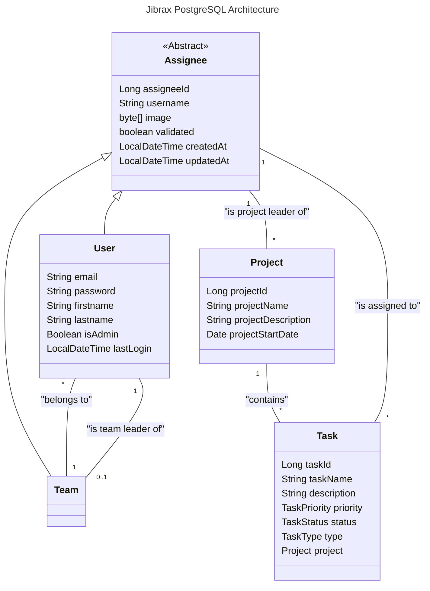

.

[TOC]

# Jibrax 

## Status

 

## Context

Jibrax is a project developed as part of the Advanced Software Architecture course in the Master’s program in Software Engineering at ISTIC, University of Rennes.
The primary objective of this project is to apply the concepts covered during the lectures, including:
- Designing and implementing the Java Persistence API (JPA),
- Exploring advanced software architecture techniques,
- Handling persistence, data modeling, and transactions,
- Integrating with a relational database (PostgreSQL) through JPA mappings.

Beyond practicing these technical aspects, we decided to implement a team-oriented project management system. The system is structured around four main entities:
- Users → individuals registered in the platform,
- Teams → groups of users collaborating together,
- Projects → initiatives managed by teams,
- Tasks → work items that make up each project.

This allows us to simulate a real-world collaborative environment while applying advanced software design and persistence principles.

## Git structure 

In this git project you may find multiple branch each corresponding to a part of the Advanced Software Architecture course.
- main
- →main-spring←
- main-servelet
- main-jaxrs-openapi

## User stories

### Write

- Create/Delete/Update a new team.
- Create/Delete/Update a new user.
- Create/Delete/Update a project.
- Create/Delete/Update a task.

### Query

- Get users' information.
- Get user by id.
- Get user by username.
- Get user by email.
- Get users' by team id.
- Get teams' information.
- Get team by id.
- Get team by name.
- Get projects' information.
- Get project by id.
- Get project by leader.
- Get task by id.
- Get tasks by project id.
- Get tasks by assignee id.

## Database Architecture

The backend relies on a PostgreSQL database running inside a Docker container. 
- Default exposed port: 5432 (can be remapped if needed). 
- Database schema and tables are generated automatically based on JPA entity definitions.

You can interact with the database using:
- The psql CLI, 
- A GUI client such as pgAdmin or DBeaver, 
- Or directly from the container with: ``docker exec -it <container_name> psql -U postgres -d <database_name>`` 

The following class diagram explains how entities are organised and linked:


The previous class diagram shows the following architecture choices:
- The abstract class _Assignee_ **is implemented by** concrete classes _User_ and _Team_
- A team **can** contain **multiple** (*) users.
- A user must be part of **one** (1) team.
- A user **can** be the team leader of **one team** (0..1).
- A project **can** contain **multiple** (*) tasks.
- A task is part of **one** (1) project.
- A project has **one** project leader which is an _Assignee_.
- An assignee **can** be the leader of **multiple** (*) project.
- A task has **one** (1) assignee entity.
- An assignee **can** be assigned to **multiple** (*) tasks.

## How to Run

### Requirements
- Java 21+ 
- Maven 
- Docker & Docker Compose

### Local setup
1. Clone or download the project: 
```
git clone https://gitlab2.istic.univ-rennes1.fr/tduluard/jibrax.git
cd jibrax
```
2. Start the service with Docker Compose (PostgreSQL + pgAdmin):
```
./startPostgres.sh
```
or
```
./startPostgres.bat
```
3. Then run the Application (JibraxApplication)
4. (Optionnal) Verify that the data has been correctly inserted into PostgreSQL by querying the database with psql or a GUI client.

### External setup

1. A PostgreSQL database is hosted on a personal TrueNAS server. **IMPORTANT**: Use it with extreme care, any misuse could result in data corruption or loss affecting other users.
2. Only the following public user is provided:
```
url: jdbc:postgresql://jibrax.tduluard.fr:5432/jibrax
username: dbuser
password: pwddbuser
```
This account has permissions limited to creating and reading tables, as well as ingesting and querying data.

3.Remember to update the ``persistenceUnitName`` in your main file to: ``postgresql-nas``.


## API Permissions

Ce tableau répertorie toutes les permissions d'accès aux différents endpoints de l'API.

### Légende

- ✅ : Accès autorisé
- ❌ : Accès refusé
- 🔓 : Accessible sans authentification

### Table des permissions

| Endpoint | Method | 🔓 Public | 👤 USER | 👔 MANAGER | 👑 ADMIN | Description |
|----------|--------|-----------|---------|------------|----------|-------------|
| **Documentation & Health** |||||||
| `/swagger-ui/**` | ALL | 🔓 | ✅ | ✅ | ✅ | Interface Swagger UI |
| `/v3/api-docs/**` | ALL | 🔓 | ✅ | ✅ | ✅ | Documentation OpenAPI |
| `/actuator/health` | GET | 🔓 | ✅ | ✅ | ✅ | Health check de l'application |
| **Authentication** |||||||
| `/api/auth/login` | POST | 🔓 | ✅ | ✅ | ✅ | Connexion utilisateur |
| `/api/auth/forgot-password` | POST | 🔓 | ✅ | ✅ | ✅ | Réinitialisation mot de passe |
| `/api/auth/pending` | GET | ❌ | ❌ | ❌ | ✅ | Liste des comptes en attente |
| `/api/auth/{id}/validate` | POST | ❌ | ❌ | ❌ | ✅ | Validation d'un compte |
| **Users** |||||||
| `/api/users` | POST | 🔓 | ✅ | ✅ | ✅ | Création d'un compte |
| `/api/users/me` | GET | ❌ | ✅ | ✅ | ✅ | Profil utilisateur courant |
| `/api/users/**` | GET | ❌ | ✅ | ✅ | ✅ | Consultation des utilisateurs |
| `/api/users/**` | PUT | ❌ | ❌ | ✅ | ✅ | Modification d'un utilisateur |
| `/api/users/**` | DELETE | ❌ | ❌ | ❌ | ✅ | Suppression d'un utilisateur |
| **Teams** |||||||
| `/api/teams/**` | GET | ❌ | ✅ | ✅ | ✅ | Consultation des équipes |
| `/api/teams` | POST | ❌ | ❌ | ✅ | ✅ | Création d'une équipe |
| `/api/teams/**` | PUT | ❌ | ❌ | ✅ | ✅ | Modification d'une équipe |
| `/api/teams/**` | DELETE | ❌ | ❌ | ❌ | ✅ | Suppression d'une équipe |
| **Projects** |||||||
| `/api/projects/**` | GET | ❌ | ✅ | ✅ | ✅ | Consultation des projets |
| `/api/projects` | POST | ❌ | ❌ | ✅ | ✅ | Création d'un projet |
| `/api/projects/**` | PUT | ❌ | ❌ | ✅ | ✅ | Modification d'un projet |
| `/api/projects/**` | DELETE | ❌ | ❌ | ❌ | ✅ | Suppression d'un projet |
| **Tasks** |||||||
| `/api/tasks/**` | GET | ❌ | ✅ | ✅ | ✅ | Consultation des tâches |
| `/api/tasks` | POST | ❌ | ✅ | ✅ | ✅ | Création d'une tâche |
| `/api/tasks/**` | PUT | ❌ | ✅ | ✅ | ✅ | Modification d'une tâche |
| `/api/tasks/**` | DELETE | ❌ | ❌ | ✅ | ✅ | Suppression d'une tâche |

### Hiérarchie des rôles

```
👑 ADMIN
  └── Tous les droits (lecture, écriture, suppression sur toutes les ressources)
  
👔 MANAGER
  └── Gestion des équipes, projets et tâches (lecture, écriture)
  └── Consultation et modification des utilisateurs
  
👤 USER
  └── Consultation des ressources (équipes, projets, tâches)
  └── Création et modification de tâches
  └── Consultation de son propre profil
```

### Notes importantes

- **Authentification** : Gérée via JWT (OAuth2 Resource Server avec Keycloak)
- **Sessions** : Stateless (aucune session côté serveur)
- **Codes d'erreur** :
    - `401 Unauthorized` : Token manquant ou invalide
    - `403 Forbidden` : Token valide mais permissions insuffisantes
- **Wildcards** : Les endpoints avec `/**` acceptent tous les sous-chemins

## How to test

For the moment, there is only three registered users in Keycloak.

|              | Alice            | Bob            | Charlie            |
|--------------|------------------|----------------|--------------------|
| **Username** | alice.admin      | bob.manager    | charlie.user       |
| **Email**    | alice@jibrax.com | bob@jibrax.com | charlie@jibrax.com |
| **Role**     | 👑 ADMIN         | 👔 MANAGER     | 👤 USER            |
| **Password** | alice123         | bob123         | charlie123         |


## Author

[Théo DULUARD](mailto:theo.duluard@etudiant.univ-rennes.fr) - Student in Software Engineering - ISTIC, University of Rennes

[Fabien GUILLOU](mailto:fabien.guillou@etudiant.univ-rennes.fr) - Student in Software Engineering - ISTIC, University of Rennes
