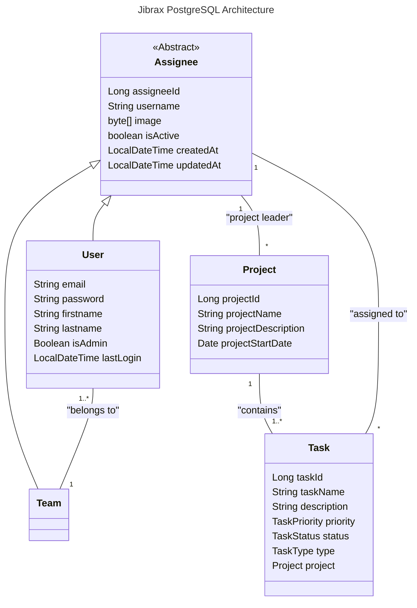

.

[TOC]

## Status


## Context

Jibrax is a project developed as part of the Advanced Software Architecture course in the Master’s program in Software Engineering at ISTIC, University of Rennes.
The primary objective of this project is to apply the concepts covered during the lectures, including:
- Designing and implementing the Java Persistence API (JPA),
- Exploring advanced software architecture techniques,
- Handling persistence, data modeling, and transactions,
- Integrating with a relational database (PostgreSQL) through JPA mappings.

Beyond practicing these technical aspects, we decided to implement a team-oriented project management system. The system is structured around four main entities:
- Users → individuals registered in the platform,
- Teams → groups of users collaborating together,
- Projects → initiatives managed by teams,
- Tasks → work items that make up each project.

This allows us to simulate a real-world collaborative environment while applying advanced software design and persistence principles.


## Database Architecture

The backend relies on a PostgreSQL database running inside a Docker container. 
- Default exposed port: 5432 (can be remapped if needed). 
- Database schema and tables are generated automatically based on JPA entity definitions.

You can interact with the database using:
- The psql CLI, 
- A GUI client such as pgAdmin or DBeaver, 
- Or directly from the container with: ``docker exec -it <container_name> psql -U postgres -d <database_name>`` 

The following class diagram explains how entities are organised and linked:


## How to Run

Requirements:
- Java 17+ 
- Maven 
- Docker & Docker Compose

Local setup:
1. Clone or download the project: 
```
git clone https://gitlab2.istic.univ-rennes1.fr/tduluard/jibrax.git
cd jibrax
```
2. Start the service with Docker Compose (PostgreSQL + pgAdmin): 
```
./startPostgres.sh
```
3. Then run Java Persistance API test (JpaTest)
4. (Optionnal) Verify that the data has been correctly inserted into PostgreSQL by querying the database with psql or a GUI client.

## Author

[Théo DULUARD](mailto:theo.duluard@etudiant.univ-rennes.fr) - Student in Software Engineering - ISTIC, University of Rennes
